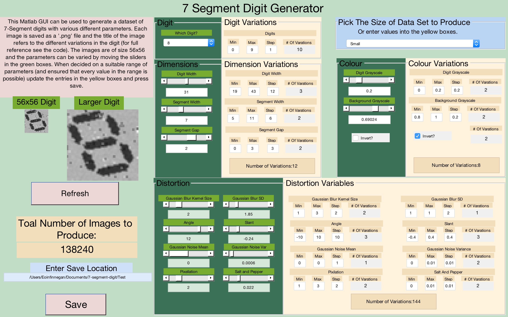

MatLab Code and GUI for generating dataset of 7-segment digits for use in training classifiers.

The GUI (Shown below) allows the user to view the effects of variations on specific parameters. The user can then enter Max, Min and Step values to generate a dataset.
