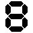
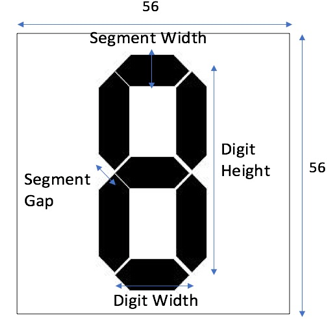
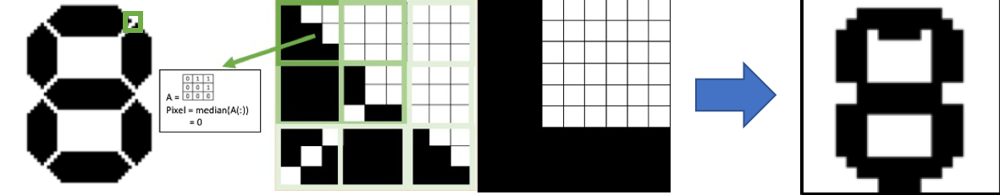

# MatLab Code and GUI for generating dataset of 7-segment digits.

The GUI (Shown below) allows the user to view the effects of variations on specific parameters. The user can then enter Max, Min and Step values to generate a dataset.

The parameter variations can be split into 3 categories:

* Dimensions
	* Dimensions(1) = Digit Width
	* Dimensions(2) = Segment Width
	* Dimensions(3) = SegmentGap

* Colour
	* Colour(1) = Digit Intensity
	* Colour(2) = Background Intensity
	* Colour(3) = Invert

* Distort 
	* Distort(1) = Angle
	* Distort(2) = Slant
	* Distort(3) = Pixellation
	* Distort(4) = Gaussian Noise Variance
	* Distort(5) = Gaussian Noise Mean
	* Distort(6) = Salt and Pepper Noise
	* Distort(7) = Gaussian Blur Kernel Size
	* Distort(8) = Gaussian Blur Variance

Each image is saved as a 56* 56 pixel .png image. The name of the saved file includes the digit variations as:

Name = 'Dimensions(1)_Dimensions(2)_Dimensions(3)_Distort(1)_Distort(2)_Colour(1)_Colour(2)_Colour(3)_Distort(3)_Distort(4)_Distort(5)_Distort(6)_Distort(7)_Distort(8).png'
Any negative values have their decimal point replaced with a '-'

Example Digit:

# Explanation and Justification of Parameters (For Project Report)

## Dimensions

The generated dataset is modelled to be very similar to the MNIST database for handwritten text recognition. The images however are twice as long and wide (56x56 rather than 28x28) so that more detail can be included when there are small step changes in dimensions. The parameters chosen to vary the dimensions of the digit were: digit width (the horizontal distance between the centres of the vertical segments), segment width (width of each segment) and segment gap (gap between each segment). The definitions for these are shown in the above image.

When classifying real digits the digit can be reshaped as any height within the 56x56 frame, it makes sense therefore to force the digit to be a set height so that the digit's aspect ratio (digit height/digit width) is affected only by varying the digit width. Digit height (vertical distance between the top and bottom horizontal segments) is kept constant at 52 pixels. The four pixel gap at the top of the scene allows for detectors to easily visualise horizontal segments.

## Colour

In order to replicate low-cost LCD screens, the contrast of the digit is adjusted by changing the background and foreground pixel intensity. The image can also be inverted for examples where the digit is displayed as white pixels on a black screen.

## Distortion

### Gaussian Blur

When a camera is out of focus it has the effect of blurring parts of the image at different depths in the scene (depending on the focal length of the camera). Therefore, cases in which the smartphone autofocus does not focus on the screen can be simulated by convolving the digit with a gaussian kernel. The properties of the kernel are the kernel size in pixels and the Gaussian variance. 

### Pixellation

Pixellation can occur either when the LCD screen or the camera taking the picture has a very low resolution. To pixellate an image, a block of pixels in the image are combined. The resulting output of this block of pixels is the median value as shown in the figure above. The pixellation is defined by the size of each block, pixellation of size 3 therefore means that a 3x3 pixel block was used.

### Gaussian Noise

Gaussian Noise (also known as Electronic noise) arises naturally in digital images by sources electronic circuit noise. It is therefore should be included noise term in the automatic digit generation. Gaussian Noise can be modelled as a statistical noise with a Gaussian PDF following equation

where mu is the mean, sigma is the standard deviation and i is the pixel intensity. mu is kept at 0 so as to have a bias towards black pixels and thus maintain a high contrast between digit and background. 

### Salt and Pepper Noise

Salt and Pepper Noise is used to model errors in image transmission where a pixel is dropped to a low or high value. Given a noise density d, an image is corrupted by setting a fraction of d/2 randomly selected pixels to be black and another fraction of d/2 randomly selected pixels to be white.

### Image Rotation

Rotated images in the digit dataset simulates the taking of pictures from different angles. It is expected that the user will try their best to generate a reasonable image (i.e. straight and planar) and so only small rotations are required to be present. The rotation is generated using the Matlab command imrotate(IMG, theta)

### Slant

When a camera is not perfectly perpendicular to the device screen, or the device display includes an italic font, a slant effect can be seen in the generated digits. Slant is generated by consecutively shifting rows above and below the middle row in opposing directions. The parameter defining the slant of an image indicates by how much each row above and below the centre is shifted.

